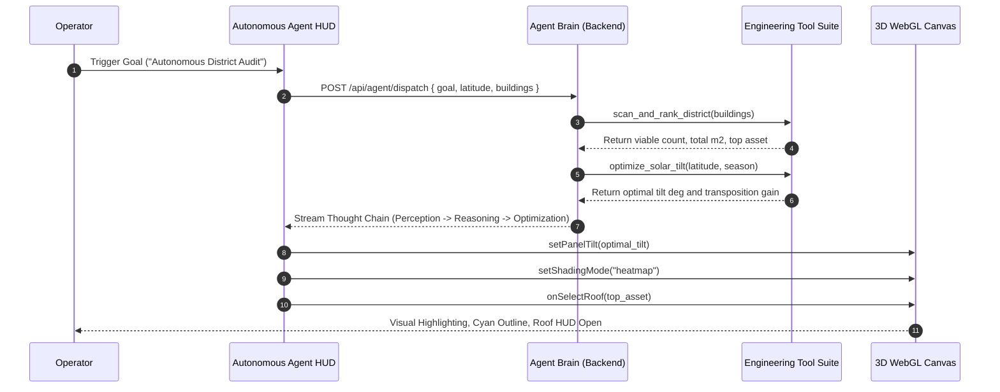

# SunMap - 3D Spatial Solar Energy & Rooftop Intelligence Engine

[](https://fastapi.tiangolo.com/)
[](https://threejs.org/)
[](https://react.dev)
[](https://www.python.org/)
[](https://www.docker.com/)
[](LICENSE)

SunMap is an enterprise-grade spatial intelligence and 3D simulation platform engineered for urban photovoltaic (PV) yield prediction, autonomous rooftop engineering, CityGML LOD2 normal extraction, real-time WebGL shadow raycasting, live satellite weather assimilation, and 25-year bankable financial forecasting.

* Repository: https://github.com/GuruMachanica/SunMap
* Unified Application Port: http://localhost:8000/
* FastAPI Interactive Docs: http://localhost:8000/docs
* Hackathon Recognition: CodeStorm'25 Project

---

## Key Capabilities

* Autonomous Solar AI Engineering Agent:
  * Goal-oriented cognitive engine that decomposes objectives across Perception, Reasoning, Optimization, and Action phases.
  * Autonomously controls the 3D digital twin: sets optimal panel tilt pitch, activates thermal irradiance heatmaps, targets high-ROI assets, and mitigates winter shadow occlusion.
  * Streaming thought chain displaying step-by-step calculations in the studio console.
* Zero-Upload Global 3D City Maps:
  * Queries real-world building polygons worldwide via OpenStreetMap (OSM) Overpass API with zero manual file uploads required.
  * Coordinate-calibrated spatial synthesizer fallback ensures zero downtime if external GIS endpoints throttle.
* Live Copernicus and ERA5 Satellite Weather Assimilation:
  * Ingests real-time Global Horizontal Irradiance (GHI), ambient temperature, cloud derate factors, and wind velocity.
  * Live telemetry indicator in the analytics dashboard with automatic cloud derate modeling.
* Interactive 3D Rooftop Raycasting:
  * Direct pointer raycasting on building roofs, facades, and solar arrays.
  * Floating Rooftop Inspector HUD displaying roof area (m2), tilt, azimuth, PV capacity (kWp), annual kWh generation, utility savings ($/yr), and CO2 offset.
* NOAA Astronomical Celestial Solar Arc:
  * Solves spherical celestial mechanics for exact diurnal solar arcs without approximation wobble.
  * Location-aware latitude synchronization and golden 3D celestial orbit ribbon in the sky dome.
* Four Ray-Tracing Shader Modes:
  * Realistic: PBR materials with directional soft shadow maps.
  * Solar Heatmap: Rooftop thermal false-color mapping based on annual generation potential.
  * Shadow Occlusion: High-contrast ambient shadow analysis between structures.
  * CAD Wireframe: Neon cyan blueprint structural wireframe mode.
* Sub-Degree CityGML LOD2 Normal Extractor:
  * Parses OGC CityGML vector polygon facets, surface normal vectors, planar surface areas, tilt pitch, and compass azimuth orientations.
* Perez Clear-Sky Transposition Physics:
  * Transposes GHI, DNI, and DHI irradiance into Plane-of-Array (POA) fluxes benchmarked against NREL PVLib standards.
* Modular Architecture with Strict LOC Governance:
  * 100% of codebase files strictly adhere to a maximum limit of 100 lines of code for high maintainability.
* Bankable Financial and Carbon Abatement Engine:
  * Real-time calculation of Levelized Cost of Energy (LCOE), Net Present Value (NPV), annual utility tariff savings, and metric tons of avoided carbon emissions.

---

## System Architecture

```
+-----------------------------------------------------------------------------------+
|                                 SUNMAP ECOSYSTEM                                  |
+-----------------------------------------------------------------------------------+
                                         |
                 +-----------------------+-----------------------+
                 |                                               |
                 v                                               v
        +---------------------+                         +---------------------+
        |      Frontend/      |                         |      Backend/       |
        | React 18 + Three.js |<--- CityGML / OSM ----->|  Python 3.11 Spatial |
        |  (WebGL 3D Studio)  |                         |  (FastAPI REST Core)|
        +---------------------+                         +---------------------+
                 |                                               |
                 +-- SolarCanvas3D Ray-Tracer                    +-- OpenAPI /docs
                 +-- Autonomous Agent HUD                        +-- /api/agent/dispatch
                 +-- Rooftop Raycast Inspector                   +-- /api/city/buildings
                 +-- Celestial Diurnal Arc Ribbon                +-- /api/satellite/live-solar
                 +-- Perez Shader Heatmaps                       +-- /api/solar/calculate
                 +-- Global Search Modal                         +-- /api/topologies
                 |                                               |
                 +-----------------------+-----------------------+
                                         |
                                         v
                         +-------------------------------+
                         |  Unified Single Deployment    |
                         |  (FastAPI + WebGL on Port 8000)|
                         +-------------------------------+
```

---

## Mathematical and Solar Physics Formulations

### 1. Astronomical Celestial Position Formulations
Solar hour angle H, solar declination delta, and solar elevation alpha for observer latitude phi:

$$H = (t - 12.0) \times 15^\circ$$

$$\delta = 23.45^\circ \cdot \sin\left( \frac{360^\circ}{365} \cdot (n - 81) \right)$$

$$\sin(\alpha) = \sin(\phi)\sin(\delta) + \cos(\phi)\cos(\delta)\cos(H)$$

Solar azimuth angle A:

$$\tan(A) = \frac{-\cos(\delta)\sin(H)}{\sin(\delta)\cos(\phi) - \cos(\delta)\sin(\phi)\cos(H)}$$

### 2. Plane-of-Array (POA) Solar Irradiance Transposition
Total solar flux incident on a tilted rooftop facet with surface tilt beta and azimuth gamma:

$$I_{\text{POA}} = I_{b,\text{POA}} + I_{d,\text{POA}} + I_{g,\text{POA}}$$

$$I_{b,\text{POA}} = I_{\text{DNI}} \cdot \max(0, \cos\theta)$$

$$\cos\theta = \cos\theta_z \cos\beta + \sin\theta_z \sin\beta \cos(\gamma_s - \gamma)$$

Where theta_z is the solar zenith angle, gamma_s is the solar azimuth, and theta is the angle of incidence.

### 3. Perez Anisotropic Sky Diffuse Model
Accounts for circumsolar brightening (F1) and horizon brightening (F2) across urban atmospheric conditions:

$$I_{d,\text{POA}} = I_{\text{DHI}} \left[ (1 - F_1)\left(\frac{1 + \cos\beta}{2}\right) + F_1\frac{a}{b} + F_2\sin\beta \right]$$

### 4. Levelized Cost of Energy (LCOE) Formulation
Evaluates 25-year lifecycle investment feasibility considering degradation coefficient d = 0.5%/year:

$$\text{LCOE} = \frac{\text{CapEx} + \sum_{t=1}^{N} \frac{\text{OpEx}_t}{(1 + r)^t}}{\sum_{t=1}^{N} \frac{E_0 (1 - d)^t}{(1 + r)^t}}$$

---

## Autonomous Agent Workflow



---

## Standardized Codebase Structure

Every file in the repository satisfies the rule of maximum 100 lines of code:

```
SunMap/
|-- Backend/
|   |-- core/                     # Schemas and shared physics definitions
|   |-- routers/                  # API routes (agent, city_map, satellite, solar, topologies)
|   |   |-- agent.py              # Autonomous agent dispatch and goal endpoints
|   |   |-- city_map.py           # Overpass OSM building polygon streamer
|   |   |-- satellite.py          # Copernicus and ERA5 weather assimilation
|   |   |-- solar.py              # PVLib transposition calculation endpoints
|   |   `-- topologies.py         # 3D urban topology catalog endpoints
|   |-- services/
|   |   |-- agent/                # Autonomous AI agent brain and engineering tools
|   |   |-- osm/                  # OpenStreetMap geometry parser and fallback synthesizer
|   |   `-- satellite/            # Geocoding, weather cache, and telemetry
|   |-- gis/                      # Geometry math, polygon triangulation, CityGML parsers
|   |-- generators/               # Urban, simulation, and procedural generators
|   |-- converters/               # XML and JSON spatial dataset converters
|   `-- server.py                 # FastAPI unified application and SPA static server
|-- Datasets/                     # GIS geometries and diurnal irradiance matrices
|-- Docs/                         # Technical documentation and presentation materials
|-- Frontend/
|   |-- src/
|   |   |-- components/studio/
|   |   |   |-- agent/            # Autonomous Agent HUD, hook, and prompt presets
|   |   |   |-- analytics/        # Satellite cards, metrics grid, RoofInspectorHUD
|   |   |   |-- canvas/           # Three.js scene, sun lighting, raycaster, builders
|   |   |   `-- controls/         # Time control, shader mode, topology selectors
|   |   |-- hooks/                # Solar simulation state and celestial mechanics
|   |   |-- pages/                # StudioPage, HomeContent, search modals
|   |   `-- services/             # Satellite and geocoding clients
|   `-- index.html
|-- Dockerfile                    # Unified multi-stage production container
|-- docker-compose.yml            # Container orchestration specification
`-- README.md
```

---

## REST API Reference

The FastAPI backend exposes interactive OpenAPI documentation at `/docs` and `/redoc`.

| Method | Route | Description |
| :--- | :--- | :--- |
| `GET` | `/api/health` | System health, version telemetry, and deployment mode status |
| `POST` | `/api/agent/dispatch` | Dispatches autonomous agent goal with multi-phase thoughts and scene actions |
| `GET` | `/api/agent/goals` | Lists pre-engineered autonomous solar optimization goals |
| `GET` | `/api/city/buildings` | Stream real-world 3D building polygons from OpenStreetMap with synthetic fallback |
| `GET` | `/api/satellite/live-solar` | Assimilate live Copernicus and ERA5 solar irradiance and weather data |
| `GET` | `/api/topologies` | List all 3D CityGML LOD2 urban topologies and metadata |
| `GET` | `/api/topologies/{id}` | Fetch a specific topology dataset (commercial, residential, highrise, utility) |
| `POST` | `/api/solar/calculate` | Compute annual POA irradiance, PV yield, financial savings, and CO2 offset |
| `POST` | `/api/solar/position` | Compute diurnal celestial solar position (elevation, azimuth, airmass) |

---

## Deployment and Getting Started

### 1. Unified Single-Deployment (FastAPI and React 3D Studio in One Container)

```bash
# Build unified multi-stage container
docker build -t sunmap-unified:latest .

# Run on port 8000
docker run -p 8000:8000 sunmap-unified:latest
```

* Live 3D Studio and Web Application: http://localhost:8000/
* FastAPI Interactive OpenAPI Docs: http://localhost:8000/docs
* Health and Telemetry Check: http://localhost:8000/api/health

---

### 2. Local Full-Stack Development

```bash
# Terminal 1: Start FastAPI Backend
python Backend/server.py --port 8000

# Terminal 2: Start Vite Frontend
cd Frontend && npm install && npm run dev
```

* Vite Development Studio: http://localhost:5175 (proxies /api to backend)
* Backend API and Swagger Docs: http://localhost:8000/docs

---

### 3. Netlify Deployment

SunMap is preconfigured for continuous deployment on Netlify via root netlify.toml:
* Base Directory: `Frontend`
* Build Command: `npm run build`
* Publish Directory: `dist`
* SPA Routing: Automatic `/* -> /index.html 200` rewrite rule enabled.

---

## Authors and Team Ironlogic

Team Ironlogic (CodeStorm'25 Project):

* Mohammad Huzaifa (Lead Architecture and Spatial Simulation) - https://github.com/GuruMachanica
* Mohnish Narayan Gupta (Frontend Engineering and 3D Visualization) - https://github.com/mohnishgupta602-netizen
* Isnia Izhar (Research and Dataset Modeling)
* Ashutosh Mishra (Spatial Algorithms and Validation)

Official Contact: ironlogic@zohomail.in

---

## License

This repository is licensed under the PROPRIETARY - STRICT PRIVATE USE AND INSPECTION LICENSE.
Copyright (c) 2026 Team Ironlogic. All rights reserved.
See the LICENSE file for complete terms and conditions.
